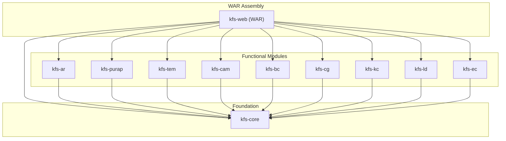

# KFS Developer Guide

> Kuali Financial System (KFS) — In-depth onboarding and reference document for developers.

---

## 1. Overview & Purpose

KFS (Kuali Financial System) is an open-source, enterprise-grade financial management system designed for higher education institutions. It manages accounting, procurement, travel, assets, grants, payroll, budgeting, and more via a **document-centric workflow model**.

| Property | Value |
|---|---|
| **Version** | `6.0.1-SNAPSHOT` (`pom.xml` line 43) |
| **Parent POM** | `org.kuali.pom:kuali-common:5.0.4` (`pom.xml` lines 37-41) |
| **GroupId** | `org.kuali.kfs` |
| **ArtifactId** | `kfs` |
| **Inception Year** | 2004 |
| **License** | GNU Affero General Public License v3 |

KFS leverages the **Kuali Rice** middleware framework for workflow (KEW), identity management (KIM), UI rendering (KNS/KRAD), service bus (KSB), and business rules (KRMS).

---

## 2. Technology Stack

| Layer | Technology | Version | Notes |
|---|---|---|---|
| **Language** | Java | 8 | Enforced via `maven-enforcer-plugin` |
| **Build** | Apache Maven | 3+ | Multi-module reactor build |
| **Database (default)** | MySQL | 5.1.25 (connector) | Default via `pom.xml` properties |
| **Database (optional)** | Oracle | 11.2.0.3 | Activate with `-Poracle` profile (`pom.xml` lines 247-256) |
| **Middleware** | Kuali Rice | 2.1.9 | KEW workflow, KIM identity, KNS/KRAD UI, KSB service bus, KRMS rules |
| **DI Framework** | Spring Framework | XML-based | Bean definitions per module (`spring-*.xml`) |
| **ORM** | Apache OJB | — | Object-relational bridge; `ojb-*.xml` mapping files per module |
| **Web Framework** | Struts 1 | — | Action/Form classes in each module's `web/struts/` package |
| **Reporting** | JasperReports | 2.0.4 | Report generation |
| **PDF** | iText | 1.4.8 | PDF output for reports and documents |
| **Logging** | SLF4J → Log4j | 1.6.4 → 1.2.16 | `pom.xml` lines 143-152 |
| **Testing** | JUnit | 4.9 | `maven-surefire-plugin` with `**/*Test.java` pattern (`pom.xml` lines 184-192) |
| **DB Migrations** | Liquibase | 3.3.2 | Scripts under `kfs-core/src/main/resources/org/kuali/kfs/db/upgrades/` |
| **Monitoring** | JavaMelody | 1.49.0 | Runtime performance monitoring |
| **Code Quality** | SonarQube | `sonar-maven-plugin` 2.6 | `pom.xml` lines 176-180 |
| **App Server** | Tomcat 7 | Plugin 2.2 | Embedded via `tomcat7-maven-plugin` |

All dependency versions are centrally managed in the root `pom.xml` lines 103-153.

---

## 3. Module Architecture (11 Maven Modules)

KFS is organized as a Maven multi-module project. The root `pom.xml` (lines 23-35) declares 11 modules. Each functional module corresponds to a distinct financial domain:

| Module | Description | Key Sub-packages |
|---|---|---|
| `kfs-core` | Foundation — Chart of Accounts (COA), General Ledger (GL), Financial Processing (FP), Pre-Disbursement Processor (PDP), Vendors (VND), Access Security (SEC), System (SYS) | `org.kuali.kfs.sys`, `org.kuali.kfs.coa`, `org.kuali.kfs.gl`, `org.kuali.kfs.fp`, `org.kuali.kfs.pdp`, `org.kuali.kfs.vnd`, `org.kuali.kfs.sec` |
| `kfs-ar` | Accounts Receivable — billing, customers, payment application, contracts & grants invoicing | `org.kuali.kfs.module.ar` |
| `kfs-purap` | Purchasing & Accounts Payable — requisitions, POs, payment requests, credit memos | `org.kuali.kfs.module.purap` |
| `kfs-tem` | Travel & Entertainment — travel authorization, reimbursement, relocation, per diem | `org.kuali.kfs.module.tem` |
| `kfs-cam` | Capital Asset Management — asset tracking, depreciation, barcode inventory | `org.kuali.kfs.module.cam` |
| `kfs-bc` | Budget Construction — annual budget planning, salary setting | `org.kuali.kfs.module.bc` |
| `kfs-cg` | Contracts & Grants — awards, proposals, agencies | `org.kuali.kfs.module.cg` |
| `kfs-kc` | Kuali Coeus Integration — external research admin integration via web services | `org.kuali.kfs.module.external.kc` |
| `kfs-ld` | Labor Distribution — labor ledger, salary/benefit expense transfers | `org.kuali.kfs.module.ld` |
| `kfs-ec` | Effort Certification — effort reporting for grant compliance | `org.kuali.kfs.module.ec` |
| `kfs-web` | Web layer (WAR) — all JSPs, Struts configs, Rice web assets, help pages | Web assets only |

---

## 4. Dependency Hierarchy Diagram

The following diagram shows the Maven dependency relationships between modules. All functional modules depend on `kfs-core`, and `kfs-web` (the WAR) aggregates them all.

> Reference: `kfs-web/pom.xml` lines 87-138



---

## 5. Internal Module Architecture Pattern

Each functional module follows a consistent layered structure:

```
module/
├── batch/              # Batch steps/jobs (Quartz-scheduled)
├── businessobject/     # Business Objects (POJOs mapped via OJB)
│   ├── datadictionary/ # XML data dictionary definitions
│   ├── lookup/         # Lookupable helper services
│   └── options/        # Values finders for dropdowns
├── dataaccess/         # DAO interfaces + OJB implementations
├── document/           # Document classes + authorization + validation
│   ├── service/        # Service interfaces + impls
│   ├── validation/     # Business rules & validation
│   └── web/struts/     # Struts Action + Form classes
├── identity/           # KIM role type services
├── report/             # Report data holders + services
├── service/            # Module service interfaces + impls
└── spring-*.xml        # Spring bean definitions
```

### Module Registration

Each module registers itself via a `FinancialSystemModuleConfiguration` bean, which extends Rice's `ModuleConfiguration`. This bean declares:

- **`namespaceCode`** — unique module identifier (e.g., `KFS-AR`, `KFS-PDP`)
- **`packagePrefixes`** — Java packages the module owns
- **`dataDictionaryPackages`** — classpath globs for data dictionary XML files
- **`databaseRepositoryFilePaths`** — OJB mapping file paths
- **`jobNames` / `triggerNames`** — Quartz batch jobs and their triggers
- **`fiscalYearMakers`** — fiscal-year rollover logic
- **`batchFileDirectories`** — staging/reporting directories for batch I/O

> Reference: `kfs-core/src/main/java/org/kuali/kfs/sys/FinancialSystemModuleConfiguration.java` and `kfs-core/src/main/resources/org/kuali/kfs/sys/spring-sys.xml` (lines 26-60)

---

## 6. Cross-Module Integration

Modules integrate through a **loose-coupling** pattern using externalizable business objects:

1. **`kfs-core` defines integration interfaces** in the `org.kuali.kfs.integration.*` packages (e.g., `org.kuali.kfs.integration.ar.AccountsReceivableCustomer`).

2. **Functional modules map interfaces to concrete implementations** via `externalizableBusinessObjectImplementations` maps in their Spring XML configs.

   Example from `kfs-ar/src/main/resources/org/kuali/kfs/module/ar/spring-ar.xml` (lines 44-58):
   ```xml
   <property name="externalizableBusinessObjectImplementations">
       <map>
           <entry key="org.kuali.kfs.integration.ar.AccountsReceivableCustomer"
                  value="org.kuali.kfs.module.ar.businessobject.Customer" />
           <entry key="org.kuali.kfs.integration.ar.AccountsReceivableDocumentHeader"
                  value="org.kuali.kfs.module.ar.businessobject.AccountsReceivableDocumentHeader" />
           <!-- ... more mappings ... -->
       </map>
   </property>
   ```

3. **Core code references only integration interfaces**, and module Spring configs map them to concrete implementations at runtime. This allows modules to be swapped or disabled without modifying core code.

---

## 7. Build System

### Maven Multi-Module Reactor Build

1. **Root `pom.xml`** defines shared dependency management (`<dependencyManagement>`), plugin management, and the module list.
2. **Build order**: `kfs-core` → functional modules (`kfs-ar`, `kfs-purap`, ...) → `kfs-web` (WAR).
3. **WAR assembly** in `kfs-web/pom.xml` (lines 22-85):
   - Unpacks `rice-standalone` WAR to extract Rice web assets (JSPs, JS, CSS)
   - Unpacks `kfs-help` JAR for context-sensitive help pages
   - Assembles all module JARs + JSPs into the final WAR
4. **Run the application**:
   ```bash
   mvn tomcat7:run-war
   ```
   Uses the embedded Tomcat 7 plugin (version 2.2).
5. **Run tests**:
   ```bash
   mvn test
   ```
   The `maven-surefire-plugin` runs `**/*Test.java` with `-Xms1024m -Xmx1024m`.
   `kfs-core` adds `-Dadditional.kfs.test.config.locations=src/test/config/${project.artifactId}.properties` (reference: `kfs-core/pom.xml` lines 18-25).
6. **Database profile**: Default is MySQL. Oracle via:
   ```bash
   mvn -Poracle <goals>
   ```
   Reference: `pom.xml` lines 247-256.
7. **Code quality**:
   ```bash
   mvn sonar:sonar
   ```
   Generates SonarQube analysis including cyclomatic complexity (CCM) scores.
8. **Database migrations**: Liquibase scripts are located under:
   ```
   kfs-core/src/main/resources/org/kuali/kfs/db/upgrades/
   ```
   Organized by version upgrade paths (e.g., `3.0.1_4.0`, `5.4.1_6.0`).

---

## 8. Batch Jobs & Scheduling

Each module registers batch jobs via its Spring XML configuration. Jobs are Quartz-scheduled via trigger beans.

### Example: PDP Module (12 batch jobs)

Reference: `kfs-core/src/main/resources/org/kuali/kfs/pdp/spring-pdp.xml` (lines 58-73)

| Job Name | Purpose |
|---|---|
| `pdpLoadPaymentsJob` | Import payment files for processing |
| `pdpNightlyLoadPaymentsJob` | Nightly scheduled payment loading |
| `pdpExtractChecksJob` | Extract check payment data |
| `pdpExtractAchPaymentsJob` | Extract ACH (electronic) payments |
| `pdpExtractCanceledChecksJob` | Extract canceled check records |
| `pdpExtractGlTransactionsStepJob` | Extract GL transactions from PDP |
| `pdpDailyReportJob` | Generate daily PDP summary report |
| `pdpClearPendingTransactionsJob` | Clear processed pending transactions |
| `pdpLoadFederalReserveBankDataJob` | Load Federal Reserve bank routing data |
| `pdpInactivatePayeeAchAccountsJob` | Deactivate stale ACH accounts |
| `processPdpCancelsAndPaidJob` | Process cancellation and paid status |
| `pdpSendAchAdviceNotificationsJob` | Send ACH payment advice emails |

### System-Level Scheduling

The `scheduleJob` trigger in `spring-sys.xml` manages the overall Quartz scheduler lifecycle. Each module's trigger beans (e.g., `pdpLoadPaymentsJobTrigger`, `pdpExtractAchPaymentsJobTrigger`) define cron-like schedules.

---

## 9. Codebase Metrics

### Overall Summary

| Metric | Count |
|---|---|
| **Java source files** | 5,716 |
| **Java lines of code** | ~1,016,000 |
| **XML configuration files** | 2,899 |
| **JSP files** | 624 |
| **Properties files** | 184 |
| **Total LOC (Java + XML + JSP + Properties)** | ~1,752,000 |
| **Complexity** | Very High (enterprise ERP) |

### Per-Module Breakdown

| Module | Java Files | Java LOC | XML Files | JSP Files | Properties |
|---|---|---|---|---|---|
| `kfs-core` | 2,447 | ~406,200 | 1,562 | 0 | 44 |
| `kfs-purap` | 707 | ~128,100 | 259 | 0 | 4 |
| `kfs-ar` | 709 | ~120,100 | 243 | 0 | 6 |
| `kfs-tem` | 527 | ~96,900 | 217 | 0 | 8 |
| `kfs-bc` | 371 | ~93,000 | 129 | 0 | 6 |
| `kfs-cam` | 318 | ~71,500 | 151 | 0 | 28 |
| `kfs-ld` | 301 | ~51,000 | 115 | 0 | 50 |
| `kfs-cg` | 134 | ~18,500 | 109 | 0 | 6 |
| `kfs-ec` | 94 | ~16,500 | 39 | 0 | 28 |
| `kfs-kc` | 108 | ~14,300 | 41 | 0 | 3 |
| `kfs-web` | 0 | 0 | 33 | 624 | 1 |

> **Note:** Run `mvn sonar:sonar` to get precise cyclomatic complexity, code coverage, code duplication, and other static analysis metrics via SonarQube.

---

## 10. Getting Started (Quick Reference)

### Prerequisites

- Java 8 JDK
- Maven 3+
- MySQL 5.5+ (or Oracle 11g+ with `-Poracle` profile)

### Steps

```bash
# 1. Clone the repository
git clone https://github.com/SachetCognition/kfs_Java8.git
cd kfs_Java8

# 2. Configure database connection properties
#    Edit kfs-core/src/main/resources/kfs-default-config.properties
#    or provide an external configuration file

# 3. Build the project (skip tests for initial build)
mvn clean install -DskipTests

# 4. Run the application
mvn tomcat7:run-war

# 5. Run tests
mvn test

# 6. Code quality analysis
mvn sonar:sonar
```

---

## 11. Key Configuration Files to Know

| File | Purpose |
|---|---|
| `pom.xml` (root) | All dependency versions, module list, profiles, plugin management |
| `kfs-web/pom.xml` | WAR assembly, Rice web asset unpacking, help page bundling |
| `kfs-core/pom.xml` | Core module build config, surefire test configuration |
| `kfs-core/src/main/resources/org/kuali/kfs/sys/spring-sys.xml` | Core system Spring beans, scheduler registration |
| `kfs-core/src/main/resources/org/kuali/kfs/pdp/spring-pdp.xml` | PDP module batch jobs and service beans |
| Each module's `spring-*.xml` | Module registration (`FinancialSystemModuleConfiguration` bean) and service beans |
| Each module's `businessobject/datadictionary/*.xml` | Data dictionary definitions (field labels, validation, lookups) |
| Each module's `ojb-*.xml` | Apache OJB object-relational mapping definitions |
| `kfs-core/src/main/resources/org/kuali/kfs/db/upgrades/` | Liquibase database migration scripts (organized by version) |
| `kfs-core/src/main/resources/kfs-default-config.properties` | Default application configuration properties |

---

## 12. Glossary

| Term | Definition |
|---|---|
| **Document** | The central unit of work in KFS. Every financial transaction (journal voucher, purchase order, travel reimbursement, etc.) is represented as a document that flows through KEW workflow for approval. |
| **Business Object (BO)** | A POJO that represents a persistent entity (e.g., `Account`, `Customer`, `Vendor`). Mapped to database tables via OJB XML descriptors. |
| **Data Dictionary** | XML metadata that defines how Business Objects are rendered in the UI — field labels, validation constraints, lookup definitions, inquiry pages, and authorization rules. |
| **OJB Mapping** | Apache ObJectRelationalBridge XML files (`ojb-*.xml`) that map Java classes to database tables and define relationships, field conversions, and query criteria. |
| **KEW (Kuali Enterprise Workflow)** | Rice's workflow engine. Routes documents through approval chains based on configurable routing rules and action lists. |
| **KIM (Kuali Identity Management)** | Rice's identity and authorization framework. Manages users, groups, roles, permissions, and responsibilities. |
| **KNS (Kuali Nervous System)** | Rice's legacy UI framework providing standardized lookup, inquiry, and maintenance document screens. |
| **KRAD (Kuali Rapid Application Development)** | Rice's next-generation UI framework (successor to KNS). Provides a component-based view model. |
| **KSB (Kuali Service Bus)** | Rice's service bus for inter-application communication. Enables synchronous and asynchronous service calls. |
| **KRMS (Kuali Rules Management System)** | Rice's business rules engine for defining and evaluating configurable rules and agendas. |
| **Batch Job / Step** | A scheduled unit of work (e.g., loading payments, generating reports) executed by the Quartz scheduler. Jobs are composed of one or more Steps. |
| **Externalizable Business Object** | An integration pattern where `kfs-core` defines interfaces for cross-module business objects, and each module provides the concrete implementation via Spring configuration. |
| **COA (Chart of Accounts)** | The foundational financial record structure defining charts, accounts, object codes, sub-accounts, and organizations. |
| **GLPE (General Ledger Pending Entry)** | An unposted accounting transaction awaiting the scrubber/poster batch cycle. |
| **PDP (Pre-Disbursement Processor)** | The payment finalization sub-system that processes ACH and check payments. |
| **FAU (Financial Accounting Unit)** | A composite key of Chart + Account + Object Code that uniquely identifies a financial line. |
| **Period 13** | A special post-close fiscal year-end adjustment period for final entries. |
| **Fiscal Year Maker** | A batch process that copies configuration data (system options, university dates) forward into the next fiscal year. |
