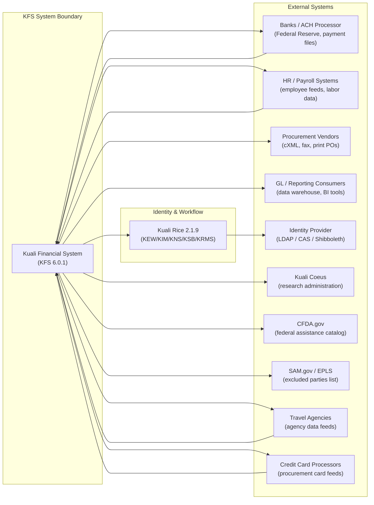
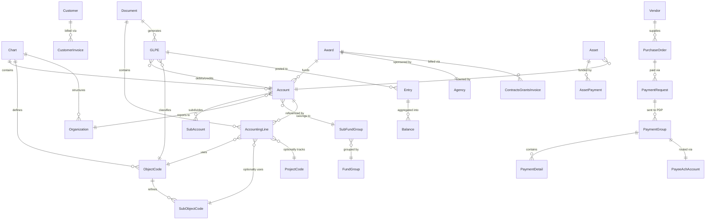
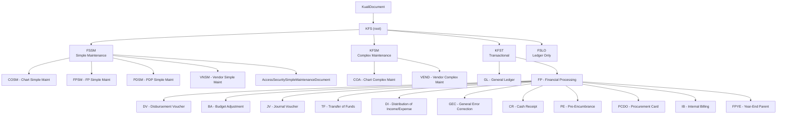
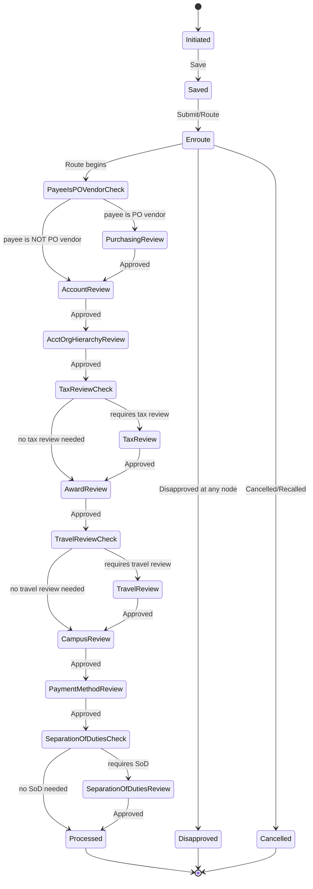
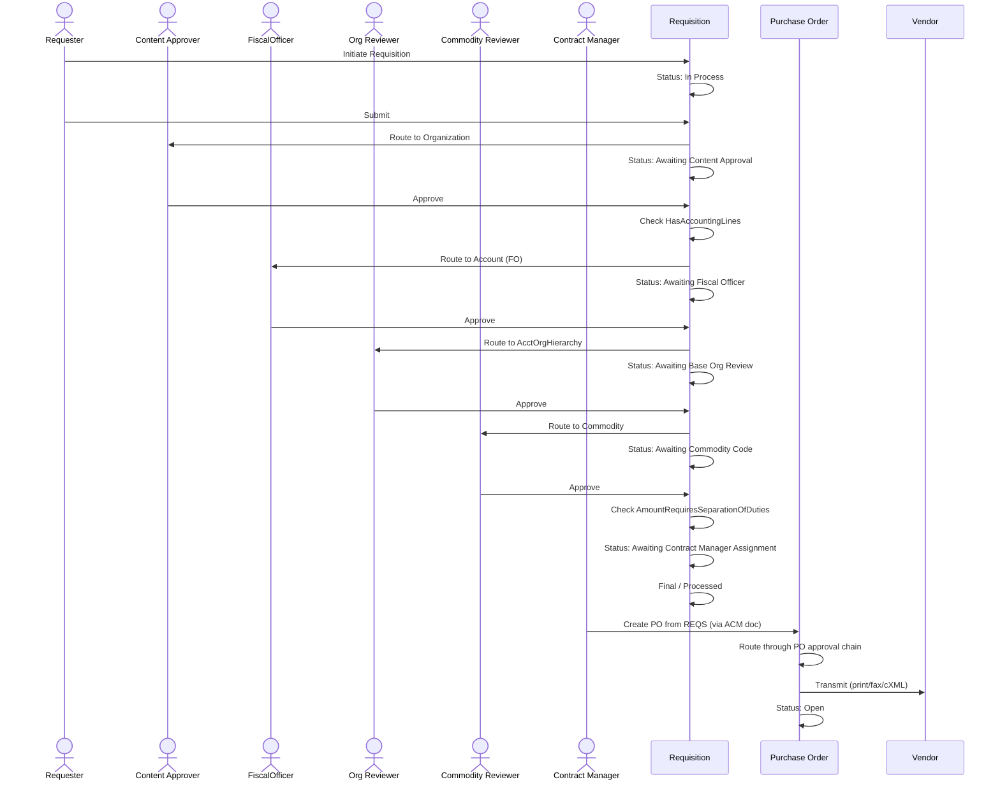
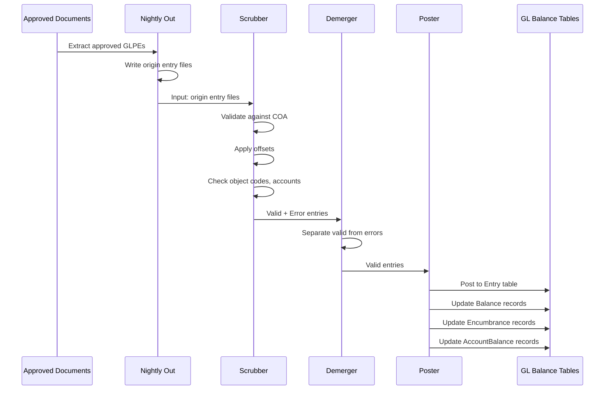
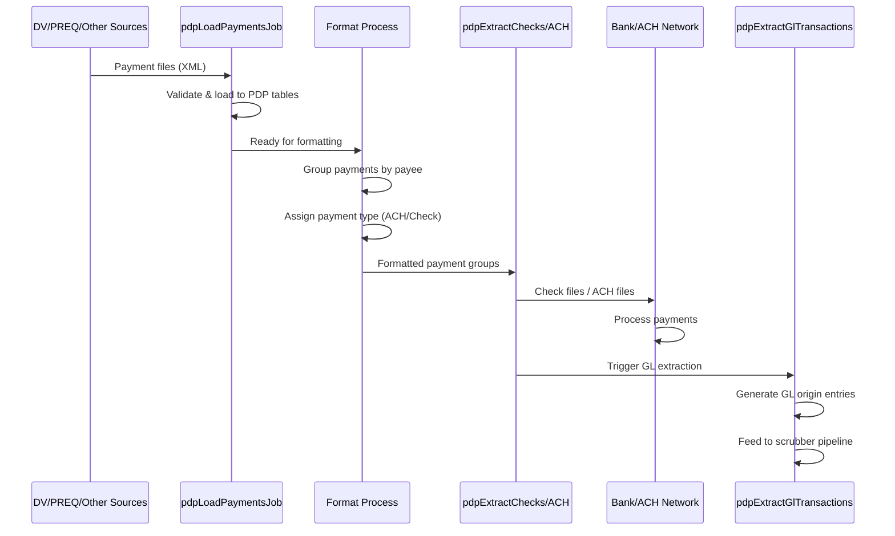
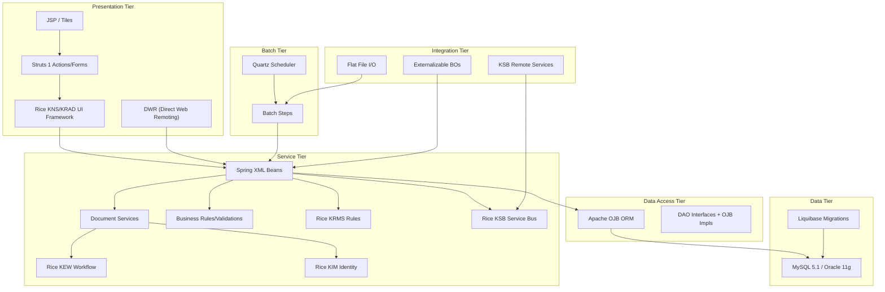

# Kuali Financial System (KFS) - Reverse Engineering Specification

> Complete reverse-engineering artifacts for rebuilding KFS on a modern Java stack (Java 21 LTS / Spring Boot 3).

---

## Table of Contents

1. [System Overview & Context](#1-system-overview--context)
2. [Business Capability & Domain Model](#2-business-capability--domain-model)
3. [Document Catalog](#3-document-catalog)
4. [User Journeys & Process Flows](#4-user-journeys--process-flows)
5. [Business Rules Catalog](#5-business-rules-catalog)
6. [Batch / Scheduled Processing Spec](#6-batch--scheduled-processing-spec)
7. [Integration Spec](#7-integration-spec)
8. [Non-Functional & Security Requirements](#8-non-functional--security-requirements)
9. [Technical Architecture (As-Is) & Modernization Mapping](#9-technical-architecture-as-is--modernization-mapping)

---

## 1. System Overview & Context

### 1.1 Purpose

KFS (Kuali Financial System) is an open-source, enterprise-grade financial ERP system designed for higher education institutions. It manages the complete financial lifecycle: accounting, procurement, travel & entertainment, capital assets, grants & contracts, labor distribution, effort certification, budgeting, and disbursements.

**Source**: `pom.xml:44` (`<name>Kuali Financial System</name>`), `DEVELOPER_GUIDE.md:9`

| Property | Value |
|---|---|
| **Version** | `6.0.1-SNAPSHOT` (`pom.xml:43`) |
| **GroupId** | `org.kuali.kfs` |
| **License** | GNU AGPLv3 |
| **Inception** | 2004 |
| **LOC** | ~1,752,000 (Java+XML+JSP+Properties) |
| **Java Files** | 5,716 |
| **XML Config Files** | 2,899 |
| **JSP Files** | 624 |

### 1.2 User Personas & Roles

| Persona | KIM Role(s) | Primary Activities |
|---|---|---|
| **Fiscal Officer** | `KFS-SYS Fiscal Officer` | Approve accounting documents, manage account budgets |
| **Account Supervisor** | `KFS-SYS Account Supervisor` | Approve documents up the org hierarchy |
| **Departmental Approver** | `KFS-COA Organization Reviewer` | Content/org-level approval routing |
| **Purchasing Agent** | `KFS-PURAP Purchasing Processor` | Create POs, process requisitions |
| **Accounts Payable Clerk** | `KFS-PURAP AP Processor` | Process payment requests, credit memos |
| **Travel Manager** | `KFS-TEM Travel Manager` | Approve travel documents, manage advances |
| **Traveler** | `KFS-TEM Traveler` | Initiate travel authorizations & reimbursements |
| **Asset Manager** | `KFS-CAM Processor` | Manage capital assets, depreciation |
| **Grant Administrator** | `KFS-CG Awards Processor` | Manage awards, proposals, C&G billing |
| **Budget Analyst** | `KFS-BC Processor` | Construct annual budgets, salary settings |
| **Effort Coordinator** | `KFS-EC Effort Certification Initiator` | Create/route effort certification reports |
| **Labor Distribution Analyst** | `KFS-LD Processor` | Process salary/benefit expense transfers |
| **PDP Administrator** | `KFS-PDP Processor` | Manage payment disbursements (ACH/check) |
| **Tax Manager** | `KFS-FP Tax Manager` | Review disbursements for tax compliance |
| **System Administrator** | `KFS-SYS Manager` | Batch scheduling, parameter config, module locking |

**Source**: KIM role type services in `kfs-core/src/main/java/org/kuali/kfs/coa/identity/`, `kfs-core/src/main/java/org/kuali/kfs/sys/identity/`

### 1.3 Capability Map by Module

| Module | Maven Artifact | Namespace | Capabilities |
|---|---|---|---|
| **SYS** (System) | `kfs-core` | `KFS-SYS` | Batch scheduling, parameter management, fiscal year maker, purge, email, module lock/unlock, document search |
| **COA** (Chart of Accounts) | `kfs-core` | `KFS-COA` | Charts, accounts, sub-accounts, object codes, organizations, project codes, prior year account management |
| **GL** (General Ledger) | `kfs-core` | `KFS-GL` | Scrubber, poster, nightly out, balance forward, encumbrance forward, nominal activity closing, org reversion, collector, enterprise feed, sufficient funds |
| **FP** (Financial Processing) | `kfs-core` | `KFS-FP` | DV, JV, BA, TF, DI, GEC, ICA, CR, CCR, AD, AV, PE, IB, ND, SB, PCDO, IAA + year-end variants |
| **PDP** (Pre-Disbursement Processor) | `kfs-core` | `KFS-PDP` | Payment loading, ACH/check extraction, cancellation processing, GL transaction extraction, Federal Reserve bank data |
| **VND** (Vendors) | `kfs-core` | `KFS-VND` | Vendor maintenance, vendor matching, EPLS (excluded parties) |
| **SEC** (Access Security) | `kfs-core` | `KFS-SEC` | Document-level security, field masking, attribute-based access control |
| **AR** (Accounts Receivable) | `kfs-ar` | `KFS-AR` | Customer invoicing, payment application, C&G billing, LOC review, dunning, lockbox, customer credit memo, write-off, collection activity |
| **PURAP** (Purchasing & AP) | `kfs-purap` | `KFS-PURAP` | Requisitions, purchase orders, PO amendments, payment requests, vendor credit memos, receiving, electronic invoicing, contract manager assignment |
| **TEM** (Travel & Entertainment) | `kfs-tem` | `KFS-TEM` | Travel authorization/amendment/close, travel reimbursement, relocation, entertainment, per diem management, agency/credit card data import |
| **CAM** (Capital Asset Management) | `kfs-cam` | `KFS-CAM` | Asset creation, transfer, retirement, depreciation, barcode inventory, fabrication, asset payment, pre-asset tagging |
| **BC** (Budget Construction) | `kfs-bc` | `KFS-BC` | Annual budget documents, salary setting, GL load, genesis |
| **CG** (Contracts & Grants) | `kfs-cg` | `KFS-CG` | Awards, proposals, agencies, CFDA management, close processing |
| **KC** (Kuali Coeus Integration) | `kfs-kc` | `KFS-KC` | External research admin integration via web services |
| **LD** (Labor Distribution) | `kfs-ld` | `KFS-LD` | Labor ledger, salary expense transfer, benefit expense transfer, labor journal voucher, labor scrubber/poster |
| **EC** (Effort Certification) | `kfs-ec` | `KFS-EC` | Effort certification creation, extraction, compliance reporting |

**Source**: `DEVELOPER_GUIDE.md:49-65`, `pom.xml:23-35`, module `spring-*.xml` configs

### 1.4 Context Diagram

### 1.5 Traceability: System Overview

| Requirement | Source File(s) | Target Component |
|---|---|---|
| Module registry | `spring-sys.xml:26-85`, each module's `spring-*.xml` | Spring Boot auto-configuration per module |
| Document-centric architecture | `KfsTopLevelDocuments.xml`, `PostProcessor.java` | Domain event-driven document services |
| External system integrations | `org.kuali.kfs.integration.*` packages | REST API gateway / async messaging |

---

## 2. Business Capability & Domain Model

### 2.1 Per-Module Domain Summary

#### 2.1.1 COA (Chart of Accounts) - Foundation

The Chart of Accounts provides the fundamental financial structure. Every financial transaction references COA entities.

**Key Business Objects** (source: `kfs-core/src/main/java/org/kuali/kfs/coa/businessobject/`):

| Business Object | Composite Key | Purpose |
|---|---|---|
| `Chart` | `chartOfAccountsCode` | Top-level organizational chart |
| `Account` | `chartOfAccountsCode` + `accountNumber` | Primary accounting unit |
| `SubAccount` | `chartOfAccountsCode` + `accountNumber` + `subAccountNumber` | Sub-division of an account |
| `ObjectCode` | `universityFiscalYear` + `chartOfAccountsCode` + `financialObjectCode` | Classifies nature of transaction (asset/liability/revenue/expense) |
| `SubObjectCode` | Year + Chart + Account + ObjectCode + `financialSubObjectCode` | Further classification |
| `Organization` | `chartOfAccountsCode` + `organizationCode` | Administrative unit |
| `ProjectCode` | `projectCode` | Cross-account project tracking |
| `BalanceType` | `financialBalanceTypeCode` | Actual, budget, encumbrance |
| `ObjectType` | `financialObjectTypeCode` | Debit normal, credit normal |
| `FundGroup` / `SubFundGroup` | `fundGroupCode` / `subFundGroupCode` | Fund classification |
| `AccountingPeriod` | `universityFiscalYear` + `universityFiscalPeriodCode` | Fiscal periods 01-13 (Period 13 = year-end adjustments) |
| `OrganizationReversion` | Year + Chart + Org | Year-end reversion rules per org |

**Source**: `kfs-core/src/main/java/org/kuali/kfs/coa/businessobject/`, OJB mapping: `kfs-core/src/main/resources/org/kuali/kfs/coa/ojb-coa.xml`

#### 2.1.2 GL (General Ledger) - Transaction Engine

| Business Object | Key | Purpose |
|---|---|---|
| `GeneralLedgerPendingEntry` (GLPE) | `transactionLedgerEntrySequenceNumber` | Unposted accounting transaction |
| `Entry` | Year+Chart+Account+SubAcct+Obj+SubObj+BalTyp+ObjTyp+Period+DocType+OrigCode+DocNbr+SeqNbr | Posted GL entry |
| `Balance` | Year+Chart+Account+SubAcct+Obj+SubObj+BalTyp+ObjTyp | Accumulated balance |
| `AccountBalance` | Year+Chart+Account+SubAcct+Obj+SubObj | Account-level balance |
| `Encumbrance` | Year+Chart+Account+SubAcct+ObjCode+SubObjCode+BalTyp+DocType+OrigCode+DocNbr | Open encumbrance |
| `ExpenditureTransaction` | Year+Chart+Account+SubAcct+Obj+SubObj+BalTyp+ObjTyp+Period+ProjectCode+OrgRefId | ICR expenditure tracking |
| `OriginEntryGroup` | `entryGroupId` | Batch origin entry group |
| `SufficientFundBalances` | Year+Chart+Account+FinObjCode | Sufficient fund checking |
| `CollectorDetail` | GroupId+SeqNbr | Collector input detail |

**Source**: `kfs-core/src/main/java/org/kuali/kfs/gl/businessobject/`, OJB: `kfs-core/src/main/resources/org/kuali/kfs/gl/ojb-gl.xml`

#### 2.1.3 FP (Financial Processing) - Core Documents

Key documents: Disbursement Voucher (DV), Journal Voucher (JV), Budget Adjustment (BA), Transfer of Funds (TF), Distribution of Income & Expense (DI), General Error Correction (GEC), Cash Receipt (CR), Advance Deposit (AD), Pre-Encumbrance (PE), Procurement Card (PCDO), Internal Billing (IB), Non-Check Disbursement (ND), Service Billing (SB), Indirect Cost Adjustment (ICA), Cash Management (CMD), Auxiliary Voucher (AV), Credit Card Receipt (CCR), Intra-Account Adjustment (IAA), plus year-end variants (YEBA, YEDI, YEGE, YETF).

**Source**: `kfs-core/src/main/config/workflow/003_kfs_core_module_docs/FinancialProcessingTransactionalDocuments.xml`

#### 2.1.4 PDP (Pre-Disbursement Processor)

| Business Object | Key | Purpose |
|---|---|---|
| `PaymentGroup` | `paymentGroupId` | Group of payments to same payee |
| `PaymentDetail` | `paymentDetailId` | Individual payment line |
| `PaymentFileLoad` | `loadId` | Batch payment file metadata |
| `PayeeAchAccount` | `achAccountGeneratedIdentifier` | ACH bank details for payee |
| `FormatProcess` | `processId` | Payment formatting run |
| `GlPendingTransaction` | Generated | PDP-originated GL entries |
| `AchBank` | `bankRoutingNumber` | Federal Reserve bank routing data |

**Source**: `kfs-core/src/main/java/org/kuali/kfs/pdp/businessobject/`, `spring-pdp.xml:34-92`

#### 2.1.5 AR (Accounts Receivable)

Key BOs: `Customer`, `CustomerInvoiceDocument`, `PaymentApplicationDocument`, `CashControlDocument`, `ContractsGrantsInvoiceDocument`, `InvoiceRecurrence`, `CustomerCreditMemoDocument`, `CustomerInvoiceWriteoffDocument`, `DunningLetter`, `Lockbox`, `CollectionActivityDocument`, `FinalBilledIndicatorDocument`, `LetterOfCreditReviewDocument`.

**Source**: `kfs-ar/src/main/java/org/kuali/kfs/module/ar/businessobject/`

#### 2.1.6 PURAP (Purchasing & Accounts Payable)

Key BOs: `RequisitionDocument`, `PurchaseOrderDocument` (+amendments, splits, void, close, reopen, retransmit), `PaymentRequestDocument`, `VendorCreditMemoDocument`, `BulkReceivingDocument`, `LineItemReceivingDocument`, `ContractManagerAssignmentDocument`, `ElectronicInvoice`.

**Source**: `kfs-purap/src/main/java/org/kuali/kfs/module/purap/businessobject/`, `kfs-purap/src/main/java/org/kuali/kfs/module/purap/document/`

#### 2.1.7 TEM (Travel & Entertainment)

Key BOs: `TravelAuthorizationDocument` (+amendment, close), `TravelReimbursementDocument`, `TravelRelocationDocument`, `TravelEntertainmentDocument`, `TemProfile`, `TravelAdvance`, `PerDiem`, `ActualExpense`, `ImportedExpense`, `AgencyStagingData`, `CreditCardStagingData`.

**Source**: `kfs-tem/src/main/java/org/kuali/kfs/module/tem/document/`, `kfs-tem/src/main/java/org/kuali/kfs/module/tem/businessobject/`

#### 2.1.8 CAM (Capital Asset Management)

Key BOs: `Asset`, `AssetGlobal`, `AssetRetirementGlobal`, `AssetTransferDocument`, `AssetPaymentDocument`, `AssetFabricationDocument`, `AssetLocationGlobal`, `BarcodeInventoryErrorDocument`, `AssetDepreciationDocument`.

**Source**: `kfs-cam/src/main/java/org/kuali/kfs/module/cam/businessobject/`, `kfs-cam/src/main/java/org/kuali/kfs/module/cam/document/`

#### 2.1.9 Other Modules

- **BC**: `BudgetConstructionDocument`, `BudgetConstructionPosition`, `PendingBudgetConstructionGeneralLedger`
- **CG**: `Award`, `Proposal`, `Agency`, `CFDA`
- **LD**: `LaborLedgerEntry`, `LaborLedgerBalance`, `LaborOriginEntry`, `BenefitsCalculation`, `PositionData`
- **EC**: `EffortCertificationDocument`, `EffortCertificationDetail`, `EffortCertificationReportDefinition`
- **KC**: Integration-only module; no standalone BOs (proxies to Kuali Coeus via web services)

### 2.2 Consolidated Conceptual Data Model

### 2.3 Key Composite Keys

| Composite Key | Components | Usage |
|---|---|---|
| **FAU** (Financial Accounting Unit) | `chartOfAccountsCode` + `accountNumber` + `financialObjectCode` | Every accounting line, GL entry |
| **Full Accounting String** | FAU + `subAccountNumber` + `financialSubObjectCode` + `projectCode` + `organizationReferenceId` | Complete transaction classification |
| **GL Entry Key** | Year + Chart + Account + SubAcct + ObjectCode + SubObjectCode + BalanceType + ObjectType + Period + DocType + OriginCode + DocNumber + SeqNbr | Unique GL entry identifier |
| **Balance Key** | Year + Chart + Account + SubAcct + ObjectCode + SubObjectCode + BalanceType + ObjectType | Aggregated balance record |

### 2.4 Glossary

| Term | Definition |
|---|---|
| **Document** | Central unit of work; every financial transaction is a document flowing through KEW workflow for approval |
| **GLPE** | General Ledger Pending Entry; unposted accounting transaction awaiting the scrubber/poster batch cycle |
| **PDP** | Pre-Disbursement Processor; final payment execution subsystem for ACH and checks |
| **FAU** | Financial Accounting Unit; composite key of Chart + Account + Object Code |
| **Period 13** | Special post-close fiscal year-end adjustment period for final entries |
| **Fiscal Year Maker** | Batch process copying configuration data forward into the next fiscal year |
| **KualiDecimal** | Java type wrapping `BigDecimal` with 2-decimal precision; ALL monetary calculations MUST use this |
| **Scrubber** | GL batch process validating origin entries against COA, applying offsets, generating error reports |
| **Poster** | GL batch process posting scrubbed valid entries to Balance, Entry, and Encumbrance tables |
| **Demerger** | GL batch process separating valid and error entries after scrubbing |
| **Collector** | GL batch process importing external origin entry files from feeder systems |
| **Enterprise Feed** | GL batch process for large-volume external GL entry imports |
| **Nightly Out** | GL batch process extracting approved GLPEs from documents into origin entry files for scrubbing |
| **Origin Entry** | Flat-file formatted GL transaction record used in batch processing pipeline |
| **Lockbox** | AR batch process importing high-volume bank payment files |
| **Dunning** | AR systematic process for debt collection and past-due customer notices |
| **LOC** (Letter of Credit) | Grant payment method drawing from external credit lines |
| **Write-off** | AR process removing uncollectible debt from active receivables |
| **Encumbrance** | Reserved/committed funds not yet expended |
| **ICR** | Indirect Cost Recovery; overhead charges applied to sponsored accounts |
| **CFDA** | Catalog of Federal Domestic Assistance; federal program identifiers |
| **cXML** | Commerce XML; electronic PO transmission format |

---

## 3. Document Catalog

### 3.1 Document Type Hierarchy

### 3.2 Complete Document Enumeration

#### 3.2.1 Financial Processing (FP) Documents

| Doc Type | Label | Route Path | GL Entries | Purpose |
|---|---|---|---|---|
| **DV** | Disbursement Voucher | AdHoc -> PayeeIsPurchaseOrderVendor? -> Account -> AcctOrgHierarchy -> RequiresTaxReview? -> Award -> RequiresTravelReview? -> Campus -> PaymentMethod -> RequiresSeparationOfDuties? | Yes - debit expense, credit liability | General-purpose payment to vendors, employees, or other payees |
| **JV** | Journal Voucher | AdHoc only | Yes - flexible debit/credit | Manual GL entries by chart staff; supports all balance types |
| **BA** | Budget Adjustment | AdHoc -> RequiresFullApproval? -> (Account -> AcctOrgHierarchy -> SubFund -> Award) | Yes - budget entries (BB balance type) | Adjust budget allocations between accounts |
| **TF** | Transfer of Funds | AdHoc -> Account -> AcctOrgHierarchy -> SubFund -> Award | Yes - debit/credit actual entries | Move funds between accounts within same fund group |
| **DI** | Distribution of Income & Expense | AdHoc -> Account -> AcctOrgHierarchy -> SubFund -> Award | Yes - offset entries | Distribute income/expenses across multiple accounts |
| **GEC** | General Error Correction | AdHoc -> Account -> AcctOrgHierarchy -> SubFund -> Award | Yes - correcting entries | Fix errors in previously posted GL entries |
| **ICA** | Indirect Cost Adjustment | AdHoc -> Account -> AcctOrgHierarchy -> SubFund -> Award | Yes - ICR debit/credit | Adjust indirect cost recovery entries |
| **CR** | Cash Receipt | AdHoc -> CashManagement -> RequireChangeRequestReview? | Yes - debit cash, credit revenue | Record cash/check deposits at campus cashier |
| **CCR** | Credit Card Receipt | AdHoc only | Yes - debit receivable, credit revenue | Record credit card payment receipts |
| **AD** | Advance Deposit | AdHoc only | Yes - debit cash, credit revenue | Record pre-authorized bank deposits |
| **CMD** | Cash Management | AdHoc only | Yes - cash reconciliation | Manage cash drawer, verify deposits from CRs |
| **AV** | Auxiliary Voucher | AdHoc -> Account -> AcctOrgHierarchy | Yes - accrual/adjustment | Post accruals, adjustments, reclassifications |
| **PE** | Pre-Encumbrance | AdHoc -> Account -> AcctOrgHierarchy -> SubFund | Yes - encumbrance entries | Reserve funds before procurement |
| **PCDO** | Procurement Card | AdHoc -> AccountFullEdit -> Account -> AcctOrgHierarchy -> SubFund -> RequiresAutoApprovalNotification? | Yes - expense entries | Process corporate credit card transactions |
| **IB** | Internal Billing | AdHoc -> Account -> AcctOrgHierarchy -> SubFund | Yes - inter-dept billing | Bill services between departments |
| **SB** | Service Billing | AdHoc only | Yes - inter-dept billing | Simplified internal billing (auto-approved) |
| **ND** | Non-Check Disbursement | AdHoc -> Account -> AcctOrgHierarchy -> SubFund -> Award | Yes - expense entries | Record non-check payments (wire, ACH) |
| **IAA** | Intra-Account Adjustment | AdHoc -> Account | Yes - within-account entries | Move amounts between object codes within same account |
| **YEBA** | Year End Budget Adjustment | Inherits FPYE route | Yes - BB entries | Period 13 budget adjustments |
| **YEDI** | Year End Distribution of I&E | Inherits FPYE route | Yes - period 13 entries | Period 13 income/expense distributions |
| **YEGE** | Year End General Error Correction | Inherits FPYE route | Yes - correcting entries | Period 13 error corrections |
| **YETF** | Year End Transfer of Funds | Inherits FPYE route | Yes - period 13 entries | Period 13 fund transfers |

**Source**: `kfs-core/src/main/config/workflow/003_kfs_core_module_docs/FinancialProcessingTransactionalDocuments.xml`

#### 3.2.2 GL Documents

| Doc Type | Label | Route Path | Purpose |
|---|---|---|---|
| **GLCP** | General Ledger Correction Process | AdHoc -> autoApproveForAsynchronousProcessing | Correct GL origin entry files before posting |

**Source**: `kfs-core/src/main/config/workflow/003_kfs_core_module_docs/GeneralLedgerDocuments.xml`

#### 3.2.3 Accounts Receivable (AR) Documents

| Doc Type | Label | Route Path | Purpose |
|---|---|---|---|
| **INV** | Customer Invoice | AdHoc -> HasRecurrence? -> (Account -> Recurrence) | Bill customers for goods/services |
| **CRM** | Customer Credit Memo | AdHoc -> Account -> AcctOrgHierarchy | Issue credit against a customer invoice |
| **INVW** | Customer Invoice Writeoff | AdHoc -> RequiresApproval? -> Account | Write off uncollectible invoices |
| **CTRL** | Cash Control | AdHoc -> Lockbox -> AssociatedWithElectronicPayment? -> ElectronicPayment | Control and batch cash receipts for AR |
| **APP** | Payment Application | Inherits AR parent route | Apply payments to customer invoices |
| **CINV** | C&G Invoice | AdHoc -> RequiresApprovalSplit? -> FundsManager | Bill sponsors for grant expenditures |
| **LCR** | C&G Letter of Credit Review | AdHoc only | Review LOC drawdowns |
| **CCA** | C&G Collection Activity | AdHoc only | Track collection efforts on past-due grants |
| **FBI** | Final Billed Indicator | AdHoc only | Mark awards as fully billed |

**Source**: `kfs-core/src/main/config/workflow/010_accounts_receivable/AccountsReceivableTransactionalDocuments.xml`

#### 3.2.4 Purchasing & Accounts Payable (PURAP) Documents

| Doc Type | Label | Route Path | Purpose |
|---|---|---|---|
| **REQS** | Requisition | AdHoc -> Organization -> HasAccountingLines? -> SubAccount -> Account -> AcctOrgHierarchy -> Commodity -> AmountRequiresSeparationOfDuties? | Request to purchase goods/services |
| **PO** | Purchase Order | AdHoc -> RequiresContractMgmt? -> Commodity -> RequiresAward? -> RequiresBudget? -> VendorIsEmployeeOrNonResident? | Official order to vendor |
| **POA** | Purchase Order Amendment | Inherits PO route | Modify existing PO |
| **ACM** | Contract Manager Assignment | AdHoc only | Assign contract manager to requisitions |
| **PREQ** | Payment Request | Complex AP routing | Process vendor invoices against POs |
| **CM** | Vendor Credit Memo | Complex AP routing | Credit from vendor against PO/PREQ |
| **RCVL** | Line Item Receiving | Receiving route | Record received goods line-by-line |
| **RCVB** | Bulk Receiving | Receiving route | Record bulk goods receipt |

**Source**: `kfs-core/src/main/config/workflow/070_purchasing_accounts_payable/PurchasingAccountsPayableTransactionalDocuments.xml`

#### 3.2.5 Travel & Entertainment (TEM) Documents

| Doc Type | Label | Route Path | Purpose |
|---|---|---|---|
| **TA** | Travel Authorization | AdHoc -> TravelerApproval? -> Account -> AcctOrgHierarchy -> DivisionApproval? -> SpecialRequest? -> RiskManagement? -> International? -> SubFund -> Award -> BudgetReview? -> SeparationOfDuties? -> TravelAdvanceRequested? -> (Travel -> PaymentMethod) | Pre-approve travel and advance funds |
| **TAA** | Travel Authorization Amendment | Inherits TA route | Amend an existing TA |
| **TAC** | Travel Authorization Close | AdHoc only (DEFAULT_APPROVE=true) | Close completed travel authorization |
| **TR** | Travel Reimbursement | Similar to TA with expense-specific nodes | Reimburse traveler for expenses |
| **ENT** | Travel Entertainment | TEM-specific routing | Reimburse entertainment expenses |
| **RELO** | Travel Relocation | TEM-specific routing with tax manager review | Reimburse relocation expenses |

**Source**: `kfs-core/src/main/config/workflow/120_travel_and_entertainment/TemTransactionalDocuments.xml`

#### 3.2.6 Capital Asset Management (CAM) Documents

| Doc Type | Label | Route Path | Purpose |
|---|---|---|---|
| **AA** | Asset Global (Add) | AdHoc -> RequiresReview? -> Account -> OrgHierarchy | Create new capital assets |
| **ARG** | Asset Retirement Global | AdHoc -> Account -> RetiredAssetTransferredExternally? -> OrgHierarchy -> RetiredAssetSoldOrGifted? -> Purchasing | Retire/dispose of assets |
| **CASM** | Asset (Edit) | Inherits CAMM route | Edit existing asset details |
| **FR** | Asset Fabrication | AdHoc -> Account -> OrgHierarchy -> Management | Record self-constructed assets |
| **ALOC** | Asset Location Global | Inherits CAMM route | Update asset locations in bulk |
| **MPAY** | Asset Payment | CAM-specific route | Record payments for assets |

**Source**: `kfs-core/src/main/config/workflow/030_capital_asset/CapitalAssetTransactionalDocuments.xml`

#### 3.2.7 Labor Distribution (LD) Documents

| Doc Type | Label | Route Path | Purpose |
|---|---|---|---|
| **ST** | Salary Expense Transfer | AdHoc -> Account -> AcctOrgHierarchy -> SubFund -> Award -> RequiresWorkstudy? | Transfer salary expenses between accounts |
| **BT** | Benefit Expense Transfer | AdHoc -> Account -> AcctOrgHierarchy -> SubFund -> Award | Transfer benefit expenses between accounts |
| **LLJV** | Labor Journal Voucher | AdHoc only | Manual labor ledger entries |
| **LLCP** | Labor Ledger Correction | AdHoc -> autoApprove | Correct labor origin entry files |
| **YEST** | Year End Salary Expense Transfer | Inherits LDYE route | Period 13 salary transfers |
| **YEBT** | Year End Benefit Expense Transfer | Inherits LDYE route | Period 13 benefit transfers |

**Source**: `kfs-core/src/main/config/workflow/060_labor_distribution/LaborDistributionTransactionalDocuments.xml`

#### 3.2.8 Vendor (VND) Documents

| Doc Type | Label | Route Path | Purpose |
|---|---|---|---|
| **PVEN** | Vendor | AdHoc -> RequiresApproval? -> Management -> Initiator | Create/maintain vendor records |

**Source**: `kfs-core/src/main/config/workflow/003_kfs_core_module_docs/VendorDocuments.xml`

#### 3.2.9 Maintenance Documents (Simple & Complex)

Numerous maintenance documents exist for reference data: `AccountMaintenanceDocument`, `ObjectCodeMaintenanceDocument`, `SubAccountMaintenanceDocument`, `OrganizationMaintenanceDocument`, `ProjectCodeMaintenanceDocument`, etc. Simple maintenance docs (FSSM children) route AdHoc-only. Complex maintenance docs (KFSM children) route through OrganizationHierarchy.

**Source**: `kfs-core/src/main/config/workflow/003_kfs_core_module_docs/ChartMaintenanceDocuments.xml`, `ChartSimpleMaintenanceDocuments.xml`, etc.

---

## 4. User Journeys & Process Flows

### 4.1 Disbursement Voucher (DV) - Full Journey

The DV is the most complex FP document with 4 conditional split nodes.

**Split Node Conditions** (from `DisbursementVoucherDocument.answerSplitNodeQuestion()`):
- `PayeeIsPurchaseOrderVendor`: `true` if payee is a vendor with an active PO
- `RequiresTaxReview`: `true` if payee is non-resident alien or payment reason requires tax review
- `RequiresTravelReview`: `true` if payment reason is travel-related
- `RequiresSeparationOfDutiesReview`: `true` if initiator is the fiscal officer on the debit account (controlled by parameter `SEPARATION_OF_DUTIES_REQUIRED_IND`)

**Source**: `kfs-core/src/main/config/workflow/003_kfs_core_module_docs/FinancialProcessingTransactionalDocuments.xml:971-1158`, `kfs-core/src/main/java/org/kuali/kfs/fp/document/DisbursementVoucherDocument.java`

### 4.2 Requisition to Purchase Order (REQS -> PO)

**Source**: `PurchasingAccountsPayableTransactionalDocuments.xml:140-289`

### 4.3 Travel Authorization (TA) - Full Journey

```mermaid
stateDiagram-v2
    [*] --> InProcess
    InProcess --> AwaitingTravelerReview: Submit
    AwaitingTravelerReview --> AwaitingFiscalOfficer: Traveler approves (or skip if initiator=traveler)
    AwaitingFiscalOfficer --> AwaitingOrgReview: FO approves
    AwaitingOrgReview --> DivisionCheck: Org reviewer approves
    DivisionCheck --> AwaitingDivisionReview: requires division approval
    DivisionCheck --> SpecialRequestCheck: no division needed
    AwaitingDivisionReview --> SpecialRequestCheck: Division approves
    SpecialRequestCheck --> AwaitingSpecialRequest: has special request
    SpecialRequestCheck --> RiskMgmtCheck: no special request
    AwaitingSpecialRequest --> RiskMgmtCheck: Special request approved
    RiskMgmtCheck --> AwaitingRiskMgmt: needs risk management
    RiskMgmtCheck --> InternationalCheck: no risk mgmt needed
    AwaitingRiskMgmt --> InternationalCheck: Risk mgmt approves
    InternationalCheck --> AwaitingInternational: is international travel
    InternationalCheck --> AwaitingSubFund: domestic travel
    AwaitingInternational --> AwaitingSubFund: International approves
    AwaitingSubFund --> AwaitingAward: SubFund approves
    AwaitingAward --> BudgetCheck: Award approves
    BudgetCheck --> AwaitingBudget: requires budget review
    BudgetCheck --> SoDCheck: no budget review needed
    AwaitingBudget --> SoDCheck: Budget approves
    SoDCheck --> AwaitingSoD: requires separation of duties
    SoDCheck --> AdvanceCheck: no SoD needed
    AwaitingSoD --> AdvanceCheck: SoD approves
    AdvanceCheck --> AwaitingTravelMgr: advance requested
    AdvanceCheck --> OpenForReimbursement: no advance
    AwaitingTravelMgr --> AwaitingDisbursementMethod: Travel mgr approves
    AwaitingDisbursementMethod --> OpenForReimbursement: Payment method approved
    OpenForReimbursement --> [*]
```

**Source**: `TemTransactionalDocuments.xml:79-373`

### 4.4 GL Batch Pipeline

**Source**: `spring-gl.xml:51-69`, GL batch steps in `kfs-core/src/main/java/org/kuali/kfs/gl/batch/`

### 4.5 PDP Payment Flow

**Source**: `spring-pdp.xml:58-81`, `kfs-core/src/main/java/org/kuali/kfs/pdp/batch/`

---

## 5. Business Rules Catalog

### 5.1 Validation Architecture

KFS uses three layers of business rule validation:

1. **Data Dictionary Constraints** (XML): field-level validation (required, min/max length, regex patterns, valid values) defined in `businessobject/datadictionary/*.xml`
2. **Spring CompositeValidation Chains** (XML): document-event-specific validation chains defined in `document/validation/configuration/*.xml`
3. **Java Rule Classes**: `*Rule.java` classes implementing `processCustomSaveDocumentBusinessRules()`, `processCustomRouteDocumentBusinessRules()`, `processCustomApproveDocumentBusinessRules()`

**Source**: `FinancialSystemValidators.xml:26-33`, data dictionary XML files per module

### 5.2 Core System Validators (Shared)

| Validator Bean ID | Class | Trigger | Logic |
|---|---|---|---|
| `AccountingDocument-accountingLineAmountPositiveValidation` | `AccountingLineAmountPositiveValidation` | Add/Update accounting line | Amount must be > 0 |
| `AccountingDocument-debitsAndCreditsBalanceValidation` | `DebitsAndCreditsBalanceValidation` | Route | Total debits must equal total credits |
| `AccountingDocument-requiredAccountingLinesCountValidation` | `RequiredAccountingLinesCountValidation` | Route | Must have >= minimum required accounting lines on both sides |
| `AccountingDocument-oneSidedRequiredAccountingLinesCountValidation` | `OneSidedRequiredAccountingLinesCountValidation` | Route | Must have >= minimum required accounting lines (one-sided docs) |
| `AccountingDocument-accountingLineAccessibleValidation` | `AccountingLineAccessibleValidation` | Add/Update line | User must have permission to use the specified account |
| `AccountingDocument-accountingLineDataDictionaryValidation` | `AccountingLineDataDictionaryValidation` | Add/Update line | Validates against data dictionary constraints |
| `AccountingDocument-IsObjectCodeAllowed-DefaultValidation` | `AccountingLineValueAllowedValidation` | Add/Update line | Object code must be in allowed set (per parameter `OBJECT_CODES`) |
| `AccountingDocument-IsObjectTypeAllowed-DefaultValidation` | `AccountingLineValueAllowedValidation` | Add/Update line | Object type must be allowed |
| `AccountingDocument-IsObjectSubTypeAllowed-DefaultValidation` | `AccountingLineValueAllowedValidation` | Add/Update line | Object sub-type must be allowed |
| `AccountingDocument-IsFundGroupAllowed-DefaultValidation` | `AccountingLineValueAllowedValidation` | Add/Update line | Fund group must be allowed |
| `AccountingDocument-IsSubFundGroupAllowed-DefaultValidation` | `AccountingLineValueAllowedValidation` | Add/Update line | Sub-fund group must be allowed |
| `AccountingDocument-referenceExistsValidation` | `ReferenceExistsValidation` | Various | Referenced entity must exist in database |
| `AccountingDocument-businessObjectDataDictionaryValidation` | `BusinessObjectDataDictionaryValidation` | Various | Full data dictionary validation on BO |

**Source**: `FinancialSystemValidators.xml:61-100`

### 5.3 Disbursement Voucher Validation Chain

The DV has one of the most complex validation chains. On route, the following validations fire in sequence:

| # | Validation | Error Key | Logic |
|---|---|---|---|
| 1 | `oneSidedRequiredAccountingLinesCountValidation` | `error.document.noAccountingLines` | >= 1 accounting line required |
| 2 | `documentFieldValidation` | Various | Validate contact name, check amount, due date, payment reason |
| 3 | `bankCodeValidation` | `error.document.bankCode.invalid` | Bank code must be valid |
| 4 | `paymentReasonValidation` | `error.document.paymentReason.*` | Payment reason code must be valid for payee type |
| 5 | `payeeInitiatorValidation` | `error.document.payee.initiator` | Payee cannot be the same as initiator (configurable) |
| 6 | `vendorInformationValidation` | `error.document.vendor.*` | Vendor must be active, not debarred |
| 7 | `payeeStateCodeValidation` | `error.document.payee.stateCode` | Payee state code must exist |
| 8 | `employeeInformationValidation` | `error.document.employee.*` | Employee status must be active if paying employee |
| 9 | `wireTransferValidation` | `error.document.wireTransfer.*` | Wire transfer fields required if payment method is wire |
| 10 | `foreignDraftValidation` | `error.document.foreignDraft.*` | Foreign draft fields required if payment method is foreign draft |
| 11 | `nonEmployeeTravelValidation` | `error.document.travel.*` | Travel fields required if payment reason is travel |
| 12 | `nonResidentAlienTaxValidation` | `error.document.nra.*` | NRA tax fields required if payee is non-resident alien |
| 13 | `accounting line validations` (per-line) | Various | Object code allowed, amount positive, account accessible |

**Source**: `DisbursementVoucherValidation.xml:26-160`, `kfs-core/src/main/java/org/kuali/kfs/fp/document/validation/impl/DisbursementVoucher*Validation.java`

### 5.4 Parameter-Driven Rule Behavior

Many rules check `ParameterService` for controlling parameters:

| Parameter Name | Namespace | Component | Default | Controls |
|---|---|---|---|---|
| `OBJECT_CODES` | Per doc type | Per doc type | Varies | Allowed/restricted object codes |
| `OBJECT_TYPES` | Per doc type | Per doc type | Varies | Allowed/restricted object types |
| `OBJECT_SUB_TYPES` | Per doc type | Per doc type | Varies | Allowed/restricted object sub-types |
| `FUND_GROUPS` | Per doc type | Per doc type | Varies | Allowed/restricted fund groups |
| `SUB_FUND_GROUPS` | Per doc type | Per doc type | Varies | Allowed/restricted sub-fund groups |
| `SEPARATION_OF_DUTIES_REQUIRED_IND` | `KFS-FP` | `DisbursementVoucher` | `Y` | Whether separation of duties routing applies |
| `TAX_REVIEW_REQUIRED_IND` | `KFS-FP` | `DisbursementVoucher` | `Y` | Whether tax review routing applies |
| `TRAVEL_REVIEW_REQUIRED_IND` | `KFS-FP` | `DisbursementVoucher` | `Y` | Whether travel review routing applies |
| `AUTO_APPROVE_IND` | `KFS-PURAP` | `PaymentRequest` | `Y` | Whether PREQs auto-approve |
| `POSITIVE_APPROVAL_REQUIRED_IND` | `KFS-PURAP` | `PaymentRequest` | `N` | Require positive approval |
| `AMOUNT_REQUIRES_SEPARATION_OF_DUTIES_REVIEW_IND` | `KFS-PURAP` | `Requisition` | `Y` | Amount threshold triggers SoD |

**Source**: Various `*Rule.java` and `*Validation.java` files; `ParameterService` lookups throughout

### 5.5 Module-Specific Validation Configs

| Module | Validation Config File | Key Validations |
|---|---|---|
| **FP** | `BudgetAdjustmentValidation.xml` | Base amount vs current amount rules, mandatory transfer object code check |
| **FP** | `CashReceiptValidation.xml` | Cash totals reconciliation, check/coin detail validation |
| **FP** | `TransferOfFundsValidation.xml` | Same fund group requirement, mandatory transfer object codes |
| **FP** | `JournalVoucherValidation.xml` | Balance type validations, encumbrance update code |
| **AR** | `CustomerInvoiceValidation.xml` | Customer existence, billing org, receivable object code |
| **AR** | `CashControlValidation.xml` | Electronic payment reference, lockbox association |
| **AR** | `ContractsGrantsInvoiceValidation.xml` | Award validity, billing frequency, billing period |
| **PURAP** | `RequisitionValidation.xml` | Vendor selection, commodity code, contract manager |
| **PURAP** | `PurchaseOrderValidation.xml` | Split limits, vendor active status, commodity approval |
| **PURAP** | `PaymentRequestValidation.xml` | PO reference, invoice matching, tax validation |
| **TEM** | `TemValidatorDefinitions.xml` | Profile validation, per diem rate, expense types |
| **TEM** | `ReimbursementValidatorDefinitions.xml` | Receipt requirements, expense limits |
| **TEM** | `RelocationValidatorDefinitions.xml` | Tax manager review triggers |
| **CAM** | `AssetPaymentValidation.xml` | Capitalization threshold, object code type |
| **LD** | `SalaryExpenseTransferValidations.xml` | Same employee requirement, labor object code |
| **LD** | `BenefitExpenseTransferValidations.xml` | Benefit object code types |

**Source**: `find -path "*/document/validation/configuration/*.xml"` in each module

---

## 6. Batch / Scheduled Processing Spec

### 6.1 GL Module Batch Jobs (15 jobs)

| Job Name | Steps | Schedule | Dependencies | Purpose |
|---|---|---|---|---|
| `nightlyOutJob` | `NightlyOutStep` | Daily (after business hours) | None | Extract approved GLPEs into origin entry files |
| `scrubberJob` | `CreateBackupGroupStep`, `ScrubberStep`, `DemergerStep` | Daily (after nightlyOut) | nightlyOutJob | Validate origin entries against COA, generate offsets, separate valid/error |
| `posterJob` | `PosterStep`, `FileRenameStep` | Daily (after scrubber) | scrubberJob | Post valid entries to Entry, Balance, Encumbrance, AccountBalance, ExpenditureTransaction tables |
| `posterBalancingJob` | `PosterBalancingStep` | Daily (after poster) | posterJob | Verify poster results balance correctly |
| `collectorJob` | `CollectorStep` | Daily | None | Import external GL entries from feeder systems via Collector XML files |
| `enterpriseFeedJob` | `EnterpriseFeedStep` | Daily | None | High-volume external GL entry import |
| `clearPendingEntriesJob` | `ClearPendingStep` | Daily (after poster) | posterJob | Remove posted GLPEs from pending table |
| `sufficientFundsAccountUpdateJob` | `SufficientFundsAccountUpdateStep` | Daily | posterJob | Rebuild sufficient funds balance cache |
| `sufficientFundsFullRebuildJob` | `SufficientFundsFullRebuildStep` | On-demand | None | Full rebuild of sufficient funds balances |
| `balanceForwardJob` | `BalanceForwardStep`, `NominalActivityClosingStep` | Year-end | encumbranceForwardJob | Forward actual balances to next fiscal year |
| `encumbranceForwardJob` | `EncumbranceForwardStep` | Year-end | None | Forward open encumbrances to next fiscal year |
| `nominalActivityClosingJob` | `NominalActivityClosingStep` | Year-end | balanceForwardJob | Close revenue/expense accounts to fund balance |
| `organizationReversionPriorYearAccountJob` | `OrgReversionPriorYearStep` | Year-end | balanceForwardJob | Revert unspent balances per org reversion rules |
| `organizationReversionCurrentYearAccountJob` | `OrgReversionCurrentYearStep` | Year-end | orgReversionPriorYear | Apply org reversion to current year |
| `manualPurgeJob` | `ManualPurgeStep` | On-demand | None | Purge old GL data per configurable retention periods |

**Source**: `spring-gl.xml:51-69`, `kfs-core/src/main/java/org/kuali/kfs/gl/batch/*.java`

### 6.2 PDP Module Batch Jobs (12 jobs)

| Job Name | Steps | Schedule | Dependencies | Purpose |
|---|---|---|---|---|
| `pdpLoadPaymentsJob` | `pdpLoadPaymentsStep` | Daily (triggered) | None | Import payment XML files for processing |
| `pdpNightlyLoadPaymentsJob` | `pdpNightlyLoadPaymentsStep` | Nightly | None | Scheduled overnight payment loading |
| `pdpExtractChecksJob` | `pdpExtractChecksStep` | Daily (after format) | Format process | Extract check payment files for printing |
| `pdpExtractAchPaymentsJob` | `pdpExtractAchPaymentsStep` | Daily (triggered) | Format process | Extract ACH payment files for electronic transmission |
| `pdpExtractCanceledChecksJob` | `pdpExtractCanceledChecksStep` | Daily (triggered) | None | Extract canceled check records |
| `pdpExtractGlTransactionsStepJob` | `pdpExtractGlTransactionsStep` | Daily (after extract) | pdpExtractChecks/ACH | Generate GL origin entries from PDP transactions |
| `pdpDailyReportJob` | `pdpDailyReportStep` | Daily | None | Generate daily PDP summary report |
| `pdpClearPendingTransactionsJob` | `pdpClearPendingTransactionsStep` | Daily (after GL extract) | pdpExtractGlTransactions | Clear processed pending GL transactions |
| `pdpLoadFederalReserveBankDataJob` | `pdpLoadFederalReserveBankDataStep` | Monthly/On-demand | None | Load Federal Reserve bank routing data |
| `pdpInactivatePayeeAchAccountsJob` | `pdpInactivatePayeeAchAccountsStep` | Daily (triggered) | None | Deactivate stale ACH accounts |
| `processPdpCancelsAndPaidJob` | `processPdpCancelsAndPaidStep` | Daily | None | Process cancellation and paid status updates |
| `pdpSendAchAdviceNotificationsJob` | `pdpSendAchAdviceNotificationsStep` | Daily (after ACH extract) | pdpExtractAchPayments | Send ACH payment advice emails to payees |

**Source**: `spring-pdp.xml:58-81`, `kfs-core/src/main/java/org/kuali/kfs/pdp/batch/*.java`

### 6.3 FP Module Batch Jobs

| Job Name | Steps | Purpose |
|---|---|---|
| `dvToPdpExtractJob` | `DvToPdpExtractStep` | Extract approved DVs to PDP payment files |
| `procurementCardLoadJob` | `ProcurementCardLoadStep` | Load procurement card transaction files |
| `procurementCardCreateDocumentsJob` | `ProcurementCardCreateDocumentsStep` | Create PCDO documents from loaded transactions |
| `procurementCardRouteDocumentsJob` | `ProcurementCardRouteDocumentsStep` | Auto-route PCDO documents |
| `procurementCardAutoApproveDocumentsJob` | `ProcurementCardAutoApproveDocumentsStep` | Auto-approve PCDO documents meeting criteria |

**Source**: `spring-fp.xml`, `kfs-core/src/main/java/org/kuali/kfs/fp/batch/*.java`

### 6.4 COA Module Batch Jobs

| Job Name | Steps | Purpose |
|---|---|---|
| `addPriorYearAccountsJob` | `AddPriorYearAccountsStep` | Copy current accounts to prior year table for year-end |
| `updatePriorYearDataJob` | `UpdatePriorYearDataStep` | Update prior year account/org data |

### 6.5 SYS Module Batch Jobs

| Job Name | Steps | Purpose |
|---|---|---|
| `scheduleJob` | `ScheduleStep` | Master scheduler that triggers other jobs per cron schedule |
| `purgeJob` | `PurgeStep` | Purge old data per retention parameters |
| `fiscalYearMakerJob` | `FiscalYearMakerStep` | Copy fiscal year configuration forward (system options, university dates, etc.) |
| `clearCacheJob` | `ClearCacheStep` | Clear application caches |
| `purgeReportsAndStagingJob` | `PurgeReportsAndStagingStep` | Clean up old report/staging files |
| `autoDisapproveJob` | `AutoDisapproveStep` | Auto-disapprove stale documents past threshold |
| `dailyEmailJob` | `DailyEmailStep` | Send daily action list reminder emails |
| `weeklyEmailJob` | `WeeklyEmailStep` | Send weekly summary emails |
| `modulesLockJob` | `ModulesLockStep` | Lock modules for maintenance |
| `modulesUnlockJob` | `ModulesUnlockStep` | Unlock modules after maintenance |

### 6.6 AR Module Batch Jobs

| Job Name | Steps | Purpose |
|---|---|---|
| `lockboxJob` | `LockboxLoadStep`, `LockboxStep` | Import and process bank lockbox payment files |
| `customerLoadJob` | `CustomerLoadStep` | Batch-load customer records |
| `customerInvoiceWriteoffBatchJob` | `CustomerInvoiceWriteoffBatchStep` | Batch process invoice write-offs |
| `contractsGrantsInvoiceBatchJob` | `ContractsGrantsInvoiceDocumentBatchStep`, `ContractsGrantsInvoiceRouteDocumentsStep` | Create and route C&G invoices |
| `letterOfCreditJob` | `LetterOfCreditCreateAndRouteDocumentsStep` | Create LOC review documents |
| `invoiceRecurrenceJob` | `InvoiceRecurrenceStep` | Generate recurring invoices |
| `customerAgingReportNotificationJob` | `CustomerAgingReportNotificationStep` | Send aging report notifications |

### 6.7 PURAP Module Batch Jobs

| Job Name | Steps | Purpose |
|---|---|---|
| `autoApprovePaymentRequestsJob` | `AutoApprovePaymentRequestsStep` | Auto-approve PREQs meeting criteria |
| `electronicInvoiceJob` | `ElectronicInvoiceStep` | Process inbound electronic invoices (cXML) |
| `autoClosePurchaseOrdersJob` | `AutoClosePurchaseOrdersStep` | Close fully-received POs |
| `autoCloseRecurringOrdersJob` | `AutoCloseRecurringOrdersStep` | Close expired recurring POs |
| `extractPdpJob` | `ExtractPdpStep` | Extract PREQ/CM payments to PDP |
| `extractPdpImmediatesJob` | `ExtractPdpImmediatesStep` | Extract immediate-pay items to PDP |
| `faxPendingDocumentJob` | `FaxPendingDocumentStep` | Fax pending POs |
| `approveLineItemReceivingJob` | `ApproveLineItemReceivingStep` | Auto-approve receiving docs |
| `receivingPaymentRequestJob` | `ReceivingPaymentRequestStep` | Match receiving to payment requests |

### 6.8 Other Module Batch Jobs

| Module | Job Name | Purpose |
|---|---|---|
| **TEM** | `agencyDataImportJob` | Import travel agency data feeds |
| **TEM** | `creditCardDataImportJob` | Import credit card transaction data |
| **TEM** | `perDiemLoadJob` | Load per diem rate tables |
| **TEM** | `temProfileExportJob` | Export TEM profiles |
| **TEM** | `temReleaseHeldEncumbranceJob` | Release held travel encumbrances |
| **CAM** | `assetDepreciationJob` | Run periodic asset depreciation |
| **CAM** | `assetYearEndDepreciationJob` | Run year-end depreciation |
| **CAM** | `cabExtractJob` | Extract capital asset builder data |
| **CAM** | `preAssetTaggingJob` | Generate pre-asset tags |
| **CG** | `cfdaBatchJob` | Download and update CFDA catalog |
| **CG** | `closeBatchJob` | Close expired proposals/awards |
| **LD** | `laborScrubberJob` | Scrub labor origin entries |
| **LD** | `laborPosterJob` | Post labor entries to labor ledger |
| **LD** | `laborNightlyOutJob` | Extract approved labor GLPEs |
| **LD** | `laborFeedJob` | Import labor data from HR/payroll |
| **LD** | `laborBalanceForwardJob` | Year-end labor balance forward |
| **EC** | `effortCertificationCreateJob` | Create effort certification documents |
| **EC** | `effortCertificationExtractJob` | Extract labor data for effort reporting |
| **VND** | `loadEplsFileJob` | Load excluded parties list from SAM.gov |
| **VND** | `vendorMatchJob` | Match vendors against EPLS |
| **BC** | `budgetConstructionGenesisJob` | Initialize budget construction data |
| **BC** | `budgetConstructionGLLoadJob` | Load GL data into budget construction |
| **BC** | `budgetConstructionUpdateJob` | Update budget construction tables |

**Source**: Various module `spring-*.xml` files, `*Step.java` classes (147 total step classes)

---

## 7. Integration Spec

### 7.1 Cross-Module Integration Pattern

KFS modules are loosely coupled via the **Externalizable Business Object** pattern:

1. `kfs-core` defines integration interfaces in `org.kuali.kfs.integration.*`
2. Each module maps interfaces to concrete implementations via `externalizableBusinessObjectImplementations` in its Spring XML
3. Core code references only integration interfaces; concrete implementations are injected at runtime

**Integration Interface Packages** (source: `kfs-core/src/main/java/org/kuali/kfs/integration/`):

| Package | Module | Key Interfaces |
|---|---|---|
| `integration.ar` | AR | `AccountsReceivableCustomer`, `AccountsReceivableDocumentHeader`, `AccountsReceivableModuleBillingService` |
| `integration.bc` | BC | `BudgetConstructionModuleService` |
| `integration.cab` | CAB | `CapitalAssetBuilderModuleService`, `CapitalAssetBuilderAssetTransactionType` |
| `integration.cam` | CAM | `CapitalAssetManagementModuleService`, `CapitalAssetManagementAsset`, `CapitalAssetManagementAssetType` |
| `integration.cg` | CG | `ContractsAndGrantsModuleService`, `ContractsAndGrantsAward`, `ContractsAndGrantsAgency` |
| `integration.ec` | EC | `EffortCertificationModuleService` |
| `integration.ld` | LD | `LaborModuleService`, `LaborLedgerEntry`, `LaborLedgerBalance`, `LaborLedgerPositionData`, `LaborLedgerBenefitsCalculation` |
| `integration.purap` | PURAP | `PurchasingAccountsPayableModuleService` |
| `integration.tem` | TEM | `TravelEntertainmentMovingModuleService` |
| `integration.common` | Shared | Common BO stubs |

Each integration package has a `*NoOp` implementation (e.g., `LaborModuleServiceNoOp`) that returns safe defaults when the module is not installed.

**Source**: `kfs-core/src/main/java/org/kuali/kfs/integration/`, `DEVELOPER_GUIDE.md:159-181`

### 7.2 External System Integrations

#### 7.2.1 Bank / ACH Integration

| Integration | Direction | Format | Files/Services |
|---|---|---|---|
| **ACH Payment Extract** | KFS -> Bank | ACH file (NACHA format) | `pdpExtractAchPaymentsStep` -> ACH file to `${staging.directory}/pdp/paymentExtract/` |
| **Check Payment Extract** | KFS -> Bank (printer) | Check file (institution-specific) | `pdpExtractChecksStep` -> check file |
| **Federal Reserve Bank Data** | Bank -> KFS | Fed routing data file | `pdpLoadFederalReserveBankDataStep` loads from `${staging.directory}/pdp/bankFederalReserve/` |
| **Lockbox Import** | Bank -> KFS | Bank lockbox flat file | `LockboxLoadStep` imports from `${staging.directory}/ar/lockbox/` |
| **Payment Status** | Bank -> KFS | Status file | `processPdpCancelsAndPaidStep` processes cancellation/paid updates |

#### 7.2.2 HR / Payroll Integration

| Integration | Direction | Format | Files/Services |
|---|---|---|---|
| **Labor Feed** | HR -> KFS | Flat file (origin entry format) | `LaborFeedStep` imports labor transactions |
| **Labor Enterprise Feed** | HR -> KFS | Flat file (enterprise format) | `LaborEnterpriseFeedStep` |
| **Employee Data** | HR -> KFS | KIM/LDAP sync | Employee records via KIM identity service |

#### 7.2.3 Vendor / Procurement Integration

| Integration | Direction | Format | Files/Services |
|---|---|---|---|
| **cXML Purchase Orders** | KFS -> Vendor | cXML (Commerce XML) | PO transmission via B2B service |
| **Fax Purchase Orders** | KFS -> Vendor | Fax | `FaxPendingDocumentStep` |
| **Electronic Invoice** | Vendor -> KFS | cXML invoice | `ElectronicInvoiceStep` processes inbound e-invoices |
| **EPLS (Excluded Parties)** | SAM.gov -> KFS | CSV/XML download | `LoadEplsFileStep` checks vendor debarment status |

#### 7.2.4 Research Administration (Kuali Coeus)

| Integration | Direction | Format | Services |
|---|---|---|---|
| **Award/Proposal Sync** | KC -> KFS | KSB Web Services | `kfs-kc` module exposes/consumes via `spring-kc.xml` |
| **Budget Integration** | KC <-> KFS | KSB Web Services | Budget data exchange for sponsored projects |
| **Effort Reporting** | KFS -> KC | KSB Web Services | Effort certification results |

#### 7.2.5 Other External Integrations

| Integration | Direction | Format | Purpose |
|---|---|---|---|
| **CFDA Catalog** | CFDA.gov -> KFS | Download | `CfdaBatchStep` updates federal assistance catalog |
| **Travel Agency Data** | Agency -> KFS | Flat file import | `AgencyDataImportStep` |
| **Credit Card Data** | Processor -> KFS | Flat file import | `CreditCardDataImportStep` |
| **Procurement Card Data** | Processor -> KFS | Flat file import | `ProcurementCardLoadStep` |
| **GL Enterprise Feed** | External -> KFS | Origin entry format | `EnterpriseFeedStep` |
| **Collector Feed** | External -> KFS | Collector XML format | `CollectorStep` |
| **Email (SMTP)** | KFS -> Mail Server | SMTP | `MailService` for notifications, ACH advice, action list emails |

### 7.3 KSB (Kuali Service Bus) Services

KFS exposes and consumes services via the Rice Service Bus:

| Service | Direction | Purpose |
|---|---|---|
| `financialSystemModuleService` | Internal | Module lifecycle management |
| `glModuleService` | Internal | GL module operations |
| `pdpModuleService` | Internal | PDP module operations |
| `arModuleService` | Internal | AR module operations |
| Bus-exported services | External (KC, etc.) | Each module's `spring-*-bus-exports.xml` exports services |

**Source**: `spring-*-bus-exports.xml` files per module, `spring-integration.xml`

---

## 8. Non-Functional & Security Requirements

### 8.1 Authorization Model

#### 8.1.1 KIM Roles & Permissions

KFS uses the Kuali Identity Management (KIM) framework for all authorization. Key components:

| Component | Purpose | Source |
|---|---|---|
| **Roles** | Define who can perform what actions | KIM role type service implementations |
| **Permissions** | Fine-grained action permissions | Data dictionary `documentAuthorizer` beans |
| **Responsibilities** | Workflow routing responsibilities | KEW workflow definitions |
| **Delegations** | Temporary role delegations | KIM delegation framework |

#### 8.1.2 KIM Role Type Services

| Role Type Service | Module | Purpose |
|---|---|---|
| `AccountDerivedRoleTypeServiceImpl` | COA | Derive account-based roles (FO, account supervisor) |
| `AccountRoleTypeServiceImpl` | COA | Account delegate roles |
| `AccountingOrganizationHierarchyReviewRoleTypeServiceImpl` | COA | Org hierarchy approval routing |
| `ChartDerivedRoleTypeServiceImpl` | COA | Chart manager roles |
| `OrganizationHierarchyReviewRoleTypeServiceImpl` | COA | Organization review routing |
| `SubAccountReviewRoleTypeServiceImpl` | COA | Sub-account approval routing |
| `SubFundReviewRoleTypeServiceImpl` | COA | Sub-fund group approval routing |
| `ContractsAndGrantsResponsibilityRoleTypeServiceImpl` | COA | C&G award-based routing |
| `FinancialSystemUserRoleTypeServiceImpl` | COA | KFS user role determination |
| `CashReceiptInitiatorDerivedRoleTypeServiceImpl` | FP | Cash receipt campus-based role |
| `CustomerRoleTypeServiceImpl` | PDP | PDP customer roles |
| `PayeeACHAccountRoleTypeServiceImpl` | PDP | ACH account management roles |
| `SecurityAttributeRoleTypeServiceImpl` | SEC | Access security attribute roles |
| `EmployeeDerivedRoleTypeServiceImpl` | SYS | Employee status-based roles |
| `ExcludeSingleActorSeparationOfDutiesRoleTypeService` | SYS | Separation of duties enforcement |
| `AccountsReceivableOrganizationDerivedRoleTypeServiceImpl` | AR | AR org-based roles |
| `CollectorRoleTypeServiceImpl` | AR | AR collector roles |
| `FundsManagerDerivedRoleTypeServiceImpl` | AR | Funds manager roles |
| `InvoiceRecurrenceDerivedRoleTypeServiceImpl` | AR | Invoice recurrence approval |
| `AssetDerivedRoleTypeServiceImpl` | CAM | Asset owner roles |
| `AccountOrganizationHierarchyRoleTypeServiceImpl` | BC | Budget org hierarchy |
| `ResearchRiskReviewRoleTypeServiceImpl` | CG | Research risk review |

**Source**: `find -name "*RoleTypeService*.java"` across all modules

#### 8.1.3 Document Authorizers

Each document type has a `DocumentAuthorizer` class controlling:
- **Edit Modes**: Which sections/fields are editable in each document state
- **Document Actions**: Which actions (save, route, approve, blanket approve, cancel, recall) are available
- **Field-level Security**: Which fields are visible/hidden/masked

| Authorizer | Module | Key Controls |
|---|---|---|
| `AccountingDocumentAuthorizerBase` | SYS | Base class for all accounting documents; enforces account access |
| `SecTransactionalDocumentAuthorizer` | SEC | Adds access security overlay (document/field-level restrictions) |
| `DisbursementVoucherDocumentAuthorizer` | FP | Tax review access, wire transfer access, payment method controls |
| `CashReceiptDocumentAuthorizer` | FP | Campus-specific cash drawer access |
| `CashManagementDocumentAuthorizer` | FP | Cash drawer management access |
| `ProcurementCardDocumentAuthorizer` | FP | Card holder vs. reconciler edit modes |
| `BudgetAdjustmentDocumentAuthorizer` | FP | Budget adjustment permissions |
| `ContractsGrantsInvoiceDocumentAuthorizer` | AR | Funds manager access, correction access |
| `CustomerInvoiceDocumentAuthorizer` | AR | AR org-based access |
| `BudgetConstructionDocumentAuthorizer` | BC | Budget org hierarchy access |
| `AssetPaymentDocumentAuthorizer` | CAM | Asset manager access |
| `TravelWorkflowDocumentAuthorizer` | TEM | Traveler vs. arranger access, profile access |

**Source**: `find -name "*DocumentAuthorizer*.java"` across all modules

#### 8.1.4 Access Security (SEC Module)

The SEC module provides an additional layer of document-level access control:
- **Security Attributes**: Restrict access based on account, organization, chart, object code, project code, sub-fund, etc.
- **Security Definitions**: Map attributes to specific restrictions (view, edit, inquiry)
- **Security Model**: Model-based security that can be assigned to principals, roles, or groups
- **Document Security Attribute**: `SensitiveDataSecurityAttribute` in workflow XML (applied to KFST documents)

**Source**: `kfs-core/src/main/java/org/kuali/kfs/sec/`, `spring-sec.xml`, `spring-sec-gl-overrides.xml`, `spring-sec-rice-overrides.xml`

### 8.2 Audit, Notes & Attachments

- **Document Notes**: Every document supports user-entered notes via Rice framework
- **Attachments**: File attachments supported on documents (stored in database or filesystem)
- **Workflow Audit Trail**: KEW maintains complete action history (initiated, routed, approved, disapproved, etc.)
- **Change Tracking**: Maintenance documents track field-level changes
- **GL Audit**: Origin entry files preserved as backup groups; scrubber/poster produce detailed error/audit reports

### 8.3 Session & Authentication

- **Authentication**: Delegated to external identity provider via Rice KIM (CAS, Shibboleth, LDAP)
- **Session Management**: Standard Servlet session (Tomcat 7); session timeout configurable
- **CSRF Protection**: Standard Struts token handling
- **Single Sign-On**: Supported via CAS protocol

### 8.4 Batch Performance Windows

- **Nightly Batch Window**: nightlyOut -> scrubber -> demerger -> poster -> clearPending (sequential pipeline)
- **Critical Path**: GL posting pipeline must complete before next business day opens
- **Year-End Processing**: encumbranceForward -> balanceForward -> nominalActivityClosing -> orgReversion (extended window)
- **PDP Processing**: loadPayments -> format -> extractChecks/ACH -> extractGlTransactions -> clearPending

### 8.5 Reporting / PDF Outputs

| Report | Module | Technology | Purpose |
|---|---|---|---|
| PDP Daily Report | PDP | JasperReports 2.0.4 | Daily payment processing summary |
| PDP ACH Advice | PDP | Email/HTML | Payment notification to ACH payees |
| GL Scrubber Report | GL | Text file | Scrubber error/valid entry counts |
| GL Poster Report | GL | Text file | Posting results summary |
| Customer Aging Report | AR | JasperReports | Customer receivable aging |
| Dunning Letters | AR | JasperReports/iText | Collection notices |
| C&G Invoice | AR | iText 1.4.8 PDF | Grant billing invoice |
| Asset Depreciation Report | CAM | Text/JasperReports | Depreciation results |
| Budget Construction Reports | BC | JasperReports | Budget worksheets |
| Travel Authorization/Reimbursement | TEM | PDF | Travel document printout |
| Purchase Order | PURAP | PDF | Printed PO for vendor |

### 8.6 Parameter-Driven Configurability

The `ParameterService` provides institution-configurable settings stored in the `KRCR_PARM_T` database table. Parameters are organized by:
- **Namespace Code** (module): `KFS-SYS`, `KFS-GL`, `KFS-FP`, `KFS-PDP`, etc.
- **Component Code** (document/step): Document type or batch step name
- **Parameter Name**: Specific configuration key
- **Parameter Type**: `VALID` (allowed values) or `INVALID` (restricted values)

This is a CRITICAL requirement for modernization: the new system must preserve the same parameter-driven configurability to avoid hardcoding institution-specific behavior.

**Source**: `kfs-core/src/main/resources/kfs-default-config.properties`, parameter lookups throughout `*Rule.java` and `*Validation.java` classes

---

## 9. Technical Architecture (As-Is) & Modernization Mapping

### 9.1 As-Is Architecture

### 9.2 Modernization Mapping

| # | Legacy Component | Technology | Target Component | Technology | Migration Risks | MUST Preserve |
|---|---|---|---|---|---|---|
| 1 | **Struts 1 + JSP/KNS/KRAD** | Struts 1.x, JSP 2.1, Tiles, Rice KNS/KRAD | **REST API + SPA Frontend** | Spring Boot 3 REST controllers + React/Angular SPA | 624 JSPs to rewrite; KNS lookup/inquiry/maintenance patterns deeply embedded; custom tag libraries | URL structure for bookmarks/links; all field-level validations; lookup/search functionality; edit mode logic |
| 2 | **Apache OJB** | OJB XML mappings (`ojb-*.xml`) | **JPA/Hibernate or jOOQ** | Jakarta Persistence 3.1 / Hibernate 6.x or jOOQ | ~100+ OJB mapping files; custom field conversions (e.g., `OjbCharBooleanConversion`); platform-specific SQL in DAO impls; composite keys extensively used | All entity relationships; field-level conversions (boolean Y/N -> true/false); composite key structures; SQL query semantics for reporting |
| 3 | **Spring XML Beans** | Spring 2.x/3.x XML config | **Spring Boot Java/Annotation Config** | Spring Boot 3.x auto-configuration | ~50+ spring-*.xml files with complex bean hierarchies; parent-bean patterns; `FinancialSystemModuleConfiguration` pattern; scope=prototype for validation beans | Module registration pattern; externalizable BO mapping; prototype-scoped validations; conditional bean loading |
| 4 | **KEW Workflow** | Rice KEW (document types, route nodes, split/join, role nodes) | **Flowable/Camunda BPMN or State Machine** | Flowable 7.x / Camunda 8 / custom state machine | 38+ workflow XML files; 60+ document types; conditional split nodes (`answerSplitNodeQuestion`); `nextAppDocStatus` transitions; `SimpleBooleanSplitNode`; ad-hoc routing; delegation | Every route node and approval step; all split conditions; nextAppDocStatus transitions; ad-hoc routing capability; recall/return/disapprove actions; parallel activation; mandatory routes |
| 5 | **KIM Identity** | Rice KIM (roles, permissions, responsibilities, delegations) | **Spring Security + OIDC/OAuth2 + Externalized RBAC** | Spring Security 6.x, Keycloak/Auth0 | 30+ KIM role type services with custom qualification logic; derived roles (account FO, org hierarchy); document authorizer pattern; edit modes; field masking | Role derivation logic (account-based, org-hierarchy-based); delegation chains; separation of duties enforcement; document-level authorizer patterns; edit mode semantics |
| 6 | **KSB Service Bus** | Rice KSB (sync/async service calls) | **REST APIs / Async Messaging** | Spring Boot REST + Kafka/RabbitMQ | Remote service registration; service endpoint discovery; synchronous call semantics | Service contracts; error handling semantics; transactional boundaries |
| 7 | **Quartz Batch** | Quartz Scheduler + custom Step/Job framework | **Spring Batch + Spring Scheduler** | Spring Batch 5.x + @Scheduled / Spring Cloud Task | 147 batch step classes; complex job chains with hard/soft dependencies; custom `AbstractStep` base class; file-based I/O patterns | Job sequencing and dependencies; all input file format parsing; all output file format generation; error handling and recovery; report generation |
| 8 | **Java 8** | Java 8 language features | **Java 21 LTS** | Java 21 + Jakarta EE 10 | `javax.*` -> `jakarta.*` namespace changes; potential use of deprecated APIs | `KualiDecimal` (wraps BigDecimal with 2-decimal scale); all monetary arithmetic; rounding behavior; date/time handling |
| 9 | **JasperReports 2.0.4 / iText 1.4.8** | Legacy report generation | **Modern Reporting** | JasperReports 6.x / OpenPDF / Apache POI | JasperReports template formats may need updating; iText 1.x API incompatible with iText 5+ (use OpenPDF as drop-in) | All report layouts; PDF generation for POs, invoices, checks; barcode generation |
| 10 | **MySQL 5.1 / Oracle 11g** | Legacy databases | **PostgreSQL / MySQL 8** | Modern RDBMS | Dual-dialect SQL (MySQL/Oracle); platform-specific DAOs (e.g., `*DaoOjb` with platform-aware parent); Liquibase scripts | All table structures; referential integrity; stored procedure equivalents (if any); full-text search patterns |
| 11 | **Liquibase 3.3.2** | Database migrations | **Flyway or Liquibase 4.x** | Modern migration tool | Upgrade path from 3.x changeset format; large number of migration scripts under `kfs-core/src/main/resources/org/kuali/kfs/db/upgrades/` | All schema evolution history; migration ordering |
| 12 | **DWR** | Direct Web Remoting (AJAX) | **REST API calls** | Fetch/Axios from SPA | DWR-specific JavaScript patterns; `dwr-*.xml` configs per module | AJAX field validation/lookup behavior; dynamic UI updates |

### 9.3 Critical Preservation Requirements

#### 9.3.1 GL Posting Logic
The GL scrubber/poster pipeline is the heart of the system. Every financial transaction eventually produces GLPEs that flow through:
1. **Nightly Out**: Extract approved GLPEs
2. **Scrubber**: Validate against COA, generate offsets/capitalization entries
3. **Demerger**: Separate valid from error
4. **Poster**: Post to Entry/Balance/Encumbrance/AccountBalance/ExpenditureTransaction

This pipeline MUST be preserved exactly. Key logic includes:
- Offset generation (automatic balancing entries)
- ICR (Indirect Cost Recovery) entry generation
- Capitalization entry generation
- Sufficient funds checking
- Debit/credit balancing validation
- Period 13 handling

**Source**: `kfs-core/src/main/java/org/kuali/kfs/gl/batch/`, `kfs-core/src/main/java/org/kuali/kfs/gl/service/impl/`

#### 9.3.2 Approval Routing
Every document's approval chain must be preserved. Key patterns:
- **Organization Hierarchy**: Routes up the org tree for approval
- **Account Delegate**: Fiscal officer can delegate approval authority
- **Split Nodes**: Conditional routing based on document attributes
- **Separation of Duties**: Prevents initiator from being sole approver
- **Ad-Hoc Routing**: User-added approvers/FYI recipients

#### 9.3.3 Money & Rounding (KualiDecimal)
ALL monetary values use `KualiDecimal` which wraps `BigDecimal` with:
- Scale of 2 decimal places
- `ROUND_HALF_UP` rounding mode
- Null-safe arithmetic operations
- Comparison operators that handle null

The modernized system MUST NOT use `double` or `float` for any monetary calculation. Use `BigDecimal` with equivalent scale/rounding.

**Source**: `org.kuali.rice.core.api.util.type.KualiDecimal`

#### 9.3.4 Fiscal Year & Period Model
- Fiscal year typically July 1 - June 30 (configurable)
- 12 regular periods + Period 13 (year-end adjustments)
- `SystemOptions` table controls fiscal year behavior
- `UniversityDate` table maps calendar dates to fiscal periods
- `FiscalYearMaker` batch copies config forward

### 9.4 Traceability: Architecture Mapping

| Legacy Artifact | Source File(s) | Target Component |
|---|---|---|
| `FinancialSystemModuleConfiguration` bean | `spring-sys.xml:28-85`, each `spring-*.xml` | Spring Boot auto-configuration `@Configuration` per module |
| `FinancialSystemTransactionalDocument` hierarchy | `KfsTopLevelDocuments.xml`, `*Document.java` | Domain entity + state machine + REST controller |
| `CompositeValidation` chains | `*Validation.xml` configs | Spring `@Validated` + Jakarta Bean Validation + custom validators |
| `scheduledJobDescriptor` beans | `spring-gl.xml`, `spring-pdp.xml`, etc. | Spring Batch `@EnableBatchProcessing` + `Job`/`Step` beans |
| `ojb-*.xml` mappings | Per module `src/main/resources/` | JPA `@Entity` annotations + `persistence.xml` or Spring Data |
| `DataDictionaryQualifierResolver` | Workflow XML route nodes | Spring Security `@PreAuthorize` + custom role evaluators |
| `SimpleBooleanSplitNode` | Workflow XML split nodes | Flowable/Camunda gateway conditions or state machine transitions |
| `ParameterService` lookups | Throughout `*Rule.java`, `*Validation.java` | Spring Boot `@ConfigurationProperties` + externalized config |
| `MailService` | Email notifications throughout | Spring Boot Mail + templating (Thymeleaf) |
| `KualiDecimal` arithmetic | All monetary calculations | `BigDecimal` with scale=2, `RoundingMode.HALF_UP` |
| `Struts Action + Form` | `web/struts/*.java` | Spring MVC `@RestController` + request DTOs |
| `JSP + Tiles + KNS tags` | `kfs-web/src/main/webapp/` | React/Angular components consuming REST API |

### 9.5 OPEN QUESTIONS

| # | Question | Context |
|---|---|---|
| 1 | What are the exact cron schedules for each batch job trigger? | Cron expressions are defined in `spring-*.xml` trigger beans but may be overridden by institution config. The default schedules need to be extracted from the `cronExpression` properties. |
| 2 | Are there institution-specific customizations in the `kfs-default-config.properties` that affect business logic? | The properties file is filtered at build time (`pom.xml:229-244`). Exact defaults need review. |
| 3 | What is the complete set of `ParameterService` parameters and their defaults? | Parameters are loaded from database `KRCR_PARM_T` table at runtime. The complete set requires database schema inspection or impex data. |
| 4 | Are there any stored procedures or database triggers in use? | The Liquibase migrations under `kfs-core/src/main/resources/org/kuali/kfs/db/upgrades/` may contain PL/SQL or stored procedures. |
| 5 | What are the exact flat file formats for PDP ACH/check extraction, lockbox import, and labor feeds? | File formats are defined in `*InputFileType.java` classes and may vary by institution. |
| 6 | What platform-specific SQL differences exist between MySQL and Oracle DAOs? | Some DAO implementations have `*DaoOjb` classes that use OJB criteria; platform-specific SQL may be in `BatchDao` implementations (e.g., BC module uses raw SQL in `SQLForStep`). |
| 7 | Are there dead/unused document types in the workflow XML? | Some maintenance document types may be inactive or unused. A runtime workflow database query would confirm active types. |
| 8 | What are the exact KIM permission/responsibility definitions? | These are typically loaded via SQL seed data (impex), not present in the Java/XML config files. |

---

## Appendix A: File Reference Index

| Category | Path Pattern | Count |
|---|---|---|
| Workflow XML | `kfs-core/src/main/config/workflow/**/*.xml` | 38 files |
| Spring Config | `**/spring-*.xml` (src only) | 39 files |
| Validation Config | `**/document/validation/configuration/*.xml` | 47 files (src only) |
| OJB Mapping | `**/ojb-*.xml` | ~15 files |
| Data Dictionary | `**/businessobject/datadictionary/*.xml` + `**/document/datadictionary/*.xml` | ~1,500+ files |
| Batch Steps | `**/*Step.java` | 147 files |
| Rule/Validation Classes | `**/*Rule.java` + `**/*Validation.java` | ~200+ files |
| Document Authorizers | `**/*DocumentAuthorizer*.java` | 30+ files |
| KIM Role Type Services | `**/*RoleTypeService*.java` | 30+ files |
| Integration Interfaces | `org.kuali.kfs.integration.*` | 21 packages |
| Liquibase Migrations | `kfs-core/src/main/resources/org/kuali/kfs/db/upgrades/` | Multiple version directories |
